# cris-queries

The SQL behind **CRIS**, A&E Networks' ratings assistant: the Snowflake tables it reads, the 22 queries that answer its questions, the benchmark that proves they reproduce A&E's published figures, and **CRISpy**, the planner that turns a question into one of those queries with the right parameters.

Everything runs on Snowflake against `AUDIENCE_DB.UBD` (Nielsen, read only) and writes to `AUDIENCE_DEV_DB.CRIS`.

**Current release: v77** (30 September 2026). Every file in a release carries the same version number: if the tables say v74, the queries, the docs and the planner say v74.

---

## Contents

1. [How it fits together](#1-how-it-fits-together)
2. [What is in the repo](#2-what-is-in-the-repo)
3. [The tables](#3-the-tables)
4. [The Nielsen rules that never change](#4-the-nielsen-rules-that-never-change)
5. [What counts as a premiere](#5-what-counts-as-a-premiere)
6. [The queries](#6-the-queries)
7. [Windows, dates and norms](#7-windows-dates-and-norms)
8. [Worked example: the lead-in](#8-worked-example-the-lead-in)
9. [CRISpy, the planner](#9-crispy-the-planner)
10. [The benchmark and the UI test log](#10-the-benchmark-and-the-ui-test-log)
11. [Shipping a change](#11-shipping-a-change)
12. [The nightly refresh](#12-the-nightly-refresh)
13. [What changed lately](#13-what-changed-lately)
14. [Still open](#14-still-open)

---

## 1. How it fits together

Nielsen delivers MIT files (Panel until 2025-09-28, Big Data from 2025-09-29). A&E's unified views in `AUDIENCE_DB.UBD` pick the right currency by date. From those views we build six prepared tables in `AUDIENCE_DEV_DB.CRIS`; the 22 queries read **only** those tables, never the unified views. CRISpy picks a query for each question, fills in its parameters and runs it. The CRIS UI shows the rows.

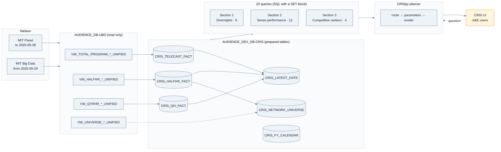

The reason for the prepared tables is a firm decision from the weekly check-in: a question must not scan a unified view. Deduplication, classification and the time arithmetic happen once at build time; the queries do windows and rankings on top, which are cheap.

---

## 2. What is in the repo

One folder per release. Everything a release needs is inside its folder, with the same version number on every file; older releases stay as they were shipped.

```
README.md                                       this file
docs/figures/                                   the figures below, with their Mermaid / SVG sources
v77/                                            current release
  CRIS_Tables_v77.ipynb                         builds the six prepared tables, in order, with checks
  CRIS_Tasks_v77.ipynb                          the nightly refresh: six chained tasks, build-and-swap, log
  CRIS_Section1_Queries_v77.ipynb               the 22 queries, one cell each, set to an A&E case
  CRIS_Section2_Queries_v77.ipynb
  CRIS_Section3_Queries_v77.ipynb
  CRIS_Section1_Queries_v77.docx                the same, every parameter explained, production defaults
  CRIS_Section2_Queries_v77.docx
  CRIS_Section3_Queries_v77.docx
  CRIS_Queries_To_Load_For_Hassan_v77.docx      only the SQL files CRIS has to load, and why
  CRIS_2_11_QH_Norm_vs_Jill.xlsx                the quarter-hour norm against A&E's sheet, row by row
  CRIS_How_It_Works_v77.docx                    the whole logic in plain language, no SQL, 27 figures
  crispy_v77.zip                                the planner, with the production SQL under app/sql
v76/, v75/, v74/, v70/                          previous releases, same layout; v70 also holds the
                                                benchmark run, the handover and the routing-logic document
```

The SQL files inside `crispy_vNN.zip` (`app/sql/qNN_*.sql`) are the production copies and carry **neutral defaults**. The A&E benchmark cases live only in the notebooks and Word documents, applied when those are generated. Nothing from a validation case ever leaks into a production default.

---

## 3. The tables

Six tables, built in this order. The three fact tables are copies of the Nielsen views, deduplicated, with the columns the queries need added once. `CRIS_LATEST_DATE` is derived from them; `CRIS_NETWORK_UNIVERSE` from the half-hour fact; `CRIS_FY_CALENDAR` from A&E's `Dim_DATE`.

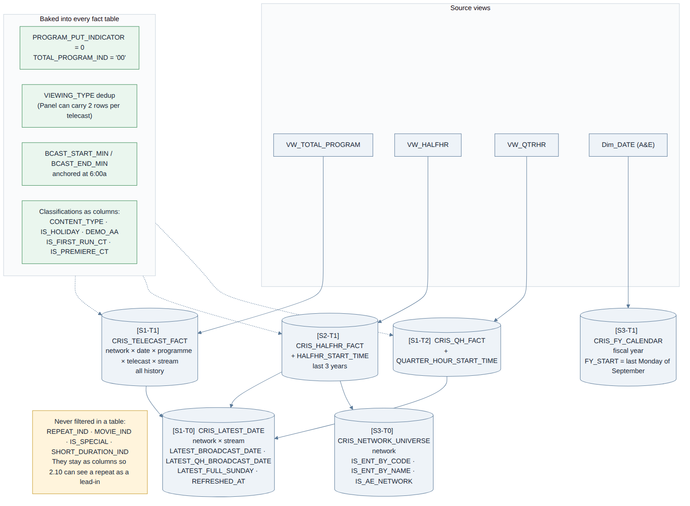

| table | one row is | built from | keep |
|---|---|---|---|
| `CRIS_TELECAST_FACT` | one telecast, in one stream | the total-programme view | all history |
| `CRIS_HALFHR_FACT` | one half hour of a telecast | the half-hour view | last 3 years |
| `CRIS_QH_FACT` | one quarter hour of a telecast | the quarter-hour view | all history |
| `CRIS_LATEST_DATE` | one network and stream | the three above | — |
| `CRIS_NETWORK_UNIVERSE` | one network (all 175) | the half-hour fact | — |
| `CRIS_FY_CALENDAR` | one fiscal year | A&E's `Dim_DATE` | — |

**The rule the tables follow: classifications become columns, filters stay in the queries.** A table records that a telecast is a movie, a special, a first run, a holiday film; it never throws one away. Whether a question includes movies is decided by the query's parameter, so a default can change without a rebuild, and 2.10 can still see a repeat as a lead-in.

What is baked in, because A&E confirmed it or because every query would otherwise redo it:

- `PROGRAM_PUT_INDICATOR = 0` and `TOTAL_PROGRAM_IND = '00'` (confirmed by A&E).
- The `VIEWING_TYPE` deduplication (see §4).
- `BROADCAST_DATE` as the reporting date.
- `BCAST_START_MIN` / `BCAST_END_MIN`, minutes since 6:00a, so no query does string time arithmetic.
- `CONTENT_TYPE` (from Cable Tracks `CT_GENRE_1`, `IS_SPECIAL` as backup), `IS_HOLIDAY`, `DEMO_AA` (the network's key demo, resolved), `IS_FIRST_RUN_CT`, `IS_PREMIERE_CT`.
- `PROGRAM_CODE` and `TELECAST_NUM`, even where the output does not show them.

**Unique keys, checked at the end of every build.** If one repeats, the filtering or the dedup is wrong, not the check:

- Telecast fact: `PROGRAM_CODE + TELECAST_NUM`
- Quarter-hour fact: `PROGRAM_CODE + TELECAST_NUM + QUARTER_HOUR_START_TIME`
- Half-hour fact: `PROGRAM_CODE + TELECAST_NUM + HALF_HOUR_START_TIME`

`CRIS_LATEST_DATE` carries `LATEST_BROADCAST_DATE`, `LATEST_QH_BROADCAST_DATE` (quarter hours arrive later), `LATEST_FULL_SUNDAY` and `REFRESHED_AT`. It exists so that no query does a `MAX` over a fact table, and so the UI can show when the data was loaded.

Since v76 the tables rebuild on their own every night (§12). The table schema is never changed without agreement first.

---

## 4. The Nielsen rules that never change

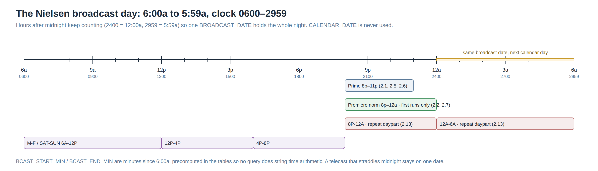

- **Panel vs Big Data.** MIT Panel to 2025-09-28, MIT Big Data from 2025-09-29. The unified view chooses; the tables inherit.
- **`VIEWING_TYPE`.** The Panel can carry two rows for the same telecast with different viewing types, and `PROGRAM_PUT_INDICATOR = 0` does not remove them. Without the dedup every count and every average doubles. The codes come from the MIT format (blank = Live with VCR, 1 = Live without VCR, 2/3 = Live+SD, 4/5 = Live+7, A/B = Live+3 in daily files) and map to the stream; nobody guesses.
- **`BROADCAST_DATE`** is Nielsen's reporting date, never `CALENDAR_DATE`. The broadcast day runs 6:00a to 5:59a on the 0600–2959 clock, so a late-night telecast belongs to the evening before it.
- **The Nielsen month** is not the calendar month: "September 2025" starts on the Monday of the Nielsen week that contains 1 September. That mapping lives in the planner with A&E's calendar, not hardcoded in SQL.
- **The fiscal year** starts on the last Monday of September (`CRIS_FY_CALENDAR`).
- **Every average is duration weighted**: `SUM(demo × minutes) / SUM(minutes)`, with `CONTRIBUTING_DURATION`, `HH_MIN` or `QH_MIN` as the weight. No simple `AVG` is left anywhere (Adarsh, 11 Sep 2026).
- **Prime is 8p–11p.** The premiere norm runs 8p–12a. A&E's eight-daypart grid (M-SU 8P-12A, 12A-6A, and M-F / SAT-SUN blocks of 6A-12P, 12P-4P, 4P-8P) belongs to the repeat question, 2.13, alone.

---

## 5. What counts as a premiere

Two different questions, two different flags, both on every fact table.

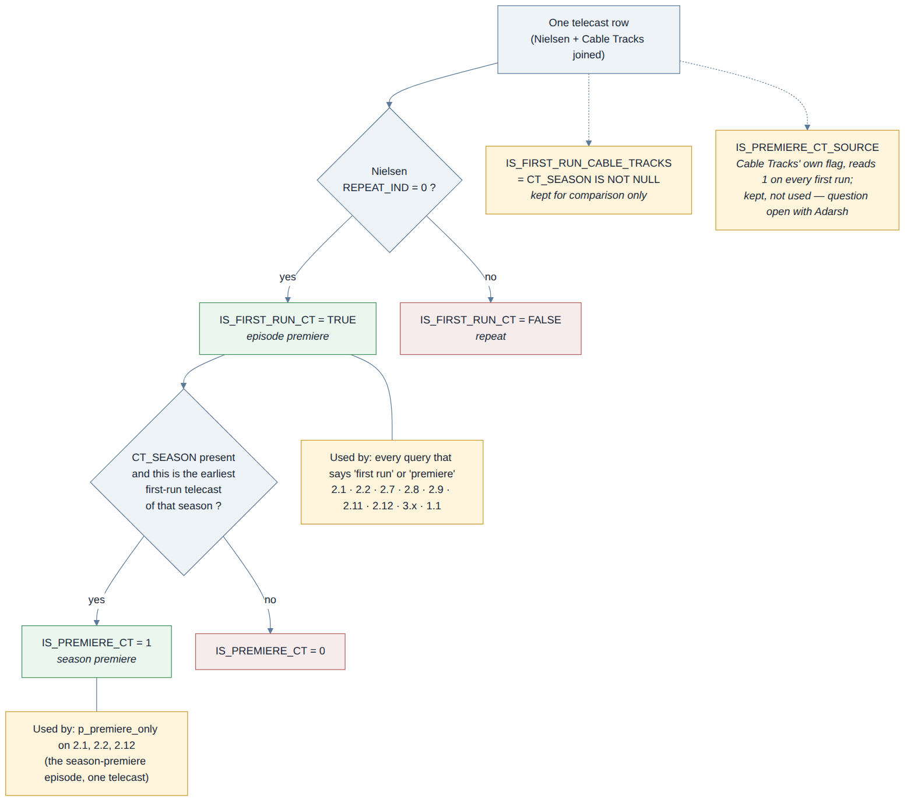

- **Episode premiere = `IS_FIRST_RUN_CT`.** Nielsen's `REPEAT_IND = 0` (A&E, 25 Sep 2026). The name stays for continuity. This is the flag every query means by "first run".
- **Season premiere = `IS_PREMIERE_CT`.** The earliest first-run telecast of a `CT_SEASON`, computed at build time with a `MIN` over the season. This is what `p_premiere_only` uses on 2.1, 2.2 and 2.12: one telecast, the season opener, against the norm. SP_7 is the reference case: 221 for the season, 266 for the season premiere.
- **Kept for comparison, read by nothing:** `IS_FIRST_RUN_CABLE_TRACKS` (`CT_SEASON IS NOT NULL`, the earlier rule) and `IS_PREMIERE_CT_SOURCE` (Cable Tracks' own flag, which reads 1 on every first run; what it is meant to mean is open with Adarsh).

A calculation whose axis is the **season** (norms, ranks, prior-season comparisons) uses only telecasts that have a `CT_SEASON`. Sub-seasons (`13B`, `2026C`) are kept separate; the merged variant of that rule is documented but not in production.

---

## 6. The queries

Twenty-two, by PRD section. Each opens with a `SET` block: every parameter is override-able, `NULL` takes the default. Each notebook cell is set to the A&E case that validates it; the Word document shows the production defaults.

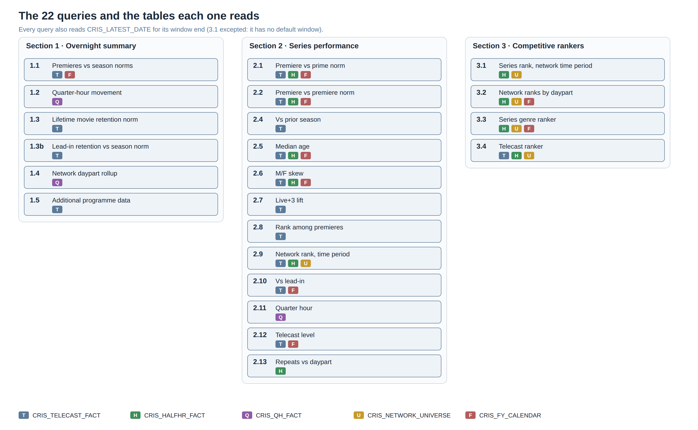

**Section 1 — the overnight summary** (the most recent night with data, or `p_target_date`)

| | answers | validated on |
|---|---|---|
| 1.1 | last night's premieres against their season norms | Parent Wars 172 exact |
| 1.2 | quarter-hour movement inside each premiere | |
| 1.3 | Lifetime movie retention against the movie norm | |
| 1.3b | lead-in retention against the season norm | |
| 1.4 | the network's dayparts, rolled up | |
| 1.5 | everything else about last night's programmes | |

**Section 2 — series performance**

| | answers | validated on |
|---|---|---|
| 2.1 | the series (or its season premiere) vs the prime norm | SP_7: Greatest Machines 221 / prime norm 182 |
| 2.2 | the series (or its season premiere) vs the premiere norm | SP_7: premiere norm 393 telecasts, 32 series |
| 2.4 | this season vs the prior season | SP_2: Neighborhood Wars 266 vs 188, +41.5% |
| 2.5 | median age vs the norm (DEMO_USED = P2) | |
| 2.6 | male/female skew vs the norm (DEMO_USED = P2) | |
| 2.7 | Live+SD → Live+3 lift vs the premiere norm | SP_IND_6 |
| 2.8 | rank among the network's premieres | SP_4: 81 movies, Double Double Trouble #1 |
| 2.9 | the network's rank in the series' time period | SP_IND_9: matches Jill after the 15-minute slot rule |
| 2.10 | each premiere telecast vs the one telecast right before it; season rollup by lead-in programme and airing | SP_IND_9: Skinwalker 324 vs 137; Modern Marvels: WWII 3 lead-ins (Jill, 28 Sep) |
| 2.11 | quarter hours, per telecast or rolled up by season, series movement vs norm movement | SP_IND_10: norm 234 / 239 / 244 / 228 on 191 / 191 / 213 / 190, Jill's sheet exact |
| 2.12 | telecast level, with the season premiere marked | |
| 2.13 | the series' repeats vs the daypart they air in | SP_IND_12: 128 (repeats-only norm) |

**Section 3 — competitive rankers** (the whole universe in rank order, the asked one marked with `IS_TARGET`, ties shown as `7 (tied)`)

| | answers | validated on |
|---|---|---|
| 3.1 | where the network ranks in the series' time period, among entertainment cable | R_3: TBSC #1, AEN #2, FOOD #3 |
| 3.2 | network ranks by daypart, fiscal year to date, all cable and entertainment cable | R_6 |
| 3.3 | series ranked within a genre | R_1: Greatest Mysteries #16 of 37 |
| 3.4 | telecasts ranked across the universe, last full week | R_4 |

Parameters that were added from A&E's feedback and that the planner sets from the wording: `p_premiere_only` (2.1, 2.2, 2.12), `p_rollup` (2.10, 2.11), `p_norm_basis` (2.11: SLOT / SHAPE / SEASON; 2.13: REPEATS / ALL), `p_leadin_grain` (2.10: TELECAST / BLOCK), `p_slot_min_min = 15` (2.9, 3.1), `p_min_leadin_min = 15` and `p_adjacent_min = 5` (2.10), `p_min_tcasts` (2.8, 3.3, no default floor).

**Output format** follows A&E's revised sheet: audience figures end in `_000`, the dates a figure covers are `FROM_DATE` and `TO_DATE`, norm dates are `NORM_FROM` and `NORM_TO`, `DEMO_USED` says which demo the query measured, rankers carry `IS_TARGET`, and 2.1 / 2.2 / 2.5 / 2.6 return their columns in the order Jill specified.

---

## 7. Windows, dates and norms

**No date is ever pinned.** Every window resolves at run time from `CRIS_LATEST_DATE`, and since v73 no window can end past the data, whatever date is passed in.

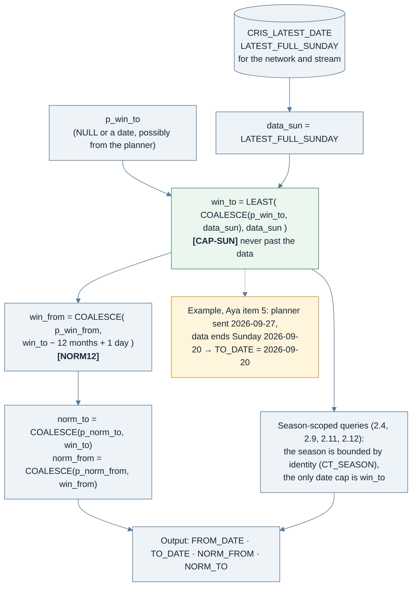

- Network norms run the **latest 12 months**, ending on the most recent full Sunday with data (A&E, 10 Sep 2026).
- A **season** is bounded by its identity, not the calendar: a season that runs longer than 12 months comes out whole; the only date cap is the window end.
- Overnights use the most recent night with data; fiscal-year-to-date uses `CRIS_FY_CALENDAR`.
- `TO_DATE` in the output is the resolved end, so a reader can always see what the figure covers.

The four norms the queries build, and what goes into each:

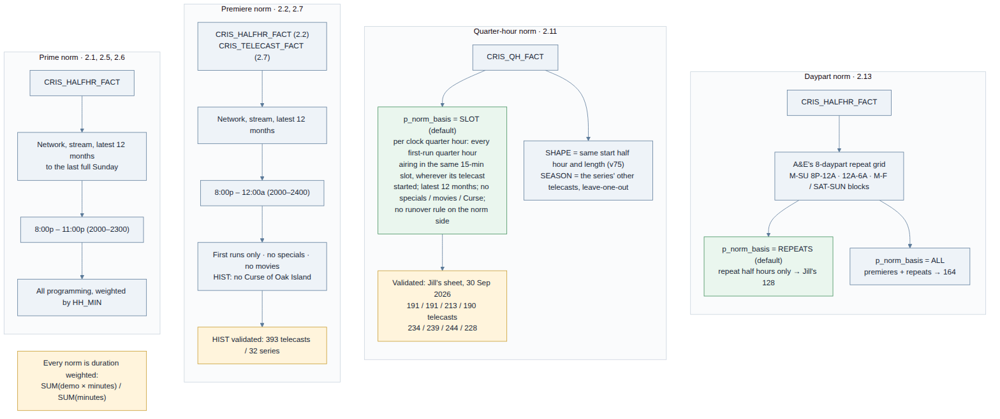

---

## 8. Worked example: the lead-in

2.10 is the query that most depends on the tables keeping repeats and shorts as columns rather than filtering them. Since v75 the unit is each premiere telecast, and its lead-in is the one telecast that ends within five minutes before it, whatever programme or airing, including a first run of the same series when two premieres air back to back (`p_leadin_grain = 'TELECAST'`; `'BLOCK'` keeps the earlier night-block rule).

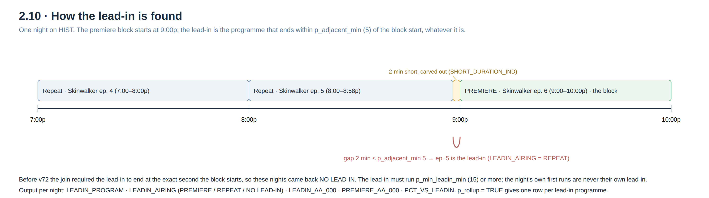

---

## 9. CRISpy, the planner

CRISpy never writes SQL. A question goes through intent (is this a ratings question), extraction (what did it name, what does its wording imply), routing (which of the 22 queries, rules first and the LLM second), pins (a wording flag becomes a parameter) and rendering (the `SET` block of the query file is rewritten). The answer comes back with every parameter used, so a figure can always be traced to its query and its window.

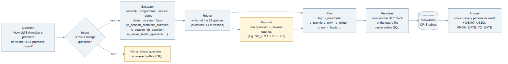

```
docker compose up -d --build
```

The `--build` matters: templates and CSS are copied into the image, so a plain restart serves the old page. `/tests` runs the 32 benchmark questions through the same path as a typed question. `docs/CRIS_Routing_Logic.docx` explains the rules and carries the prompt text verbatim; `crispy/APPLY_vNN.md` is the change log for the planner.

Routing rules worth knowing: a question that names a season premiere goes to 2.2 with `p_premiere_only`; "among entertainment cable" sends a time-period rank to 3.1 rather than 2.9; a movie ranker goes to 2.8 at telecast grain; a series lead-in question sets `p_rollup` on 2.10; a season quarter-hour question sets `p_rollup` on 2.11; a dated question is not an overnight unless it asks about one night.

---

## 10. The benchmark and the UI test log

Thirty-two questions from A&E's validation workbook, in two forms:

- **`CRIS_Benchmark_Run`** renders each one exactly as CRISpy would and runs it in Snowflake; **`CRIS_Benchmark_Results`** records expected against obtained, one tab per case. As of v70, 19 of the 20 cases with a published figure match exactly.
- **`CRIS_UI_Test_Log_25Sep`** is the same 32 questions typed into the CRIS UI, with the result classified: correct end to end, wording (right rows, wrong sentence), routing, planner, or a stale query in CRIS. 17 of 32 were correct end to end on 25 Sep; the rest are tracked there with the fix each needs.

Run the benchmark after any change to a query, a default, a prompt or a table. Routing that was right can stop being right, and the run is the only way to know.

---

## 11. Shipping a change

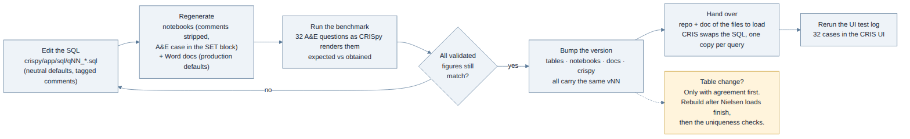

1. Edit the SQL under `crispy/app/sql`. Keep the defaults neutral. Tag any non-obvious rule with its decision tag (`[S1-SEASON-B]`, `[CAP-SUN]`, `[S2-DPNORM]`, …) and say what the code did before and why it changed.
2. Regenerate the notebooks (comments stripped, A&E case in the `SET` block) and the Word documents (production defaults, parameter glossary).
3. Run the benchmark. Every validated figure must still match, or the change says explicitly which output moves and against what it is revalidated.
4. Bump the version everywhere, even the files that did not change, so a release is one number.
5. Hand over: the repo, plus a document listing only the SQL files CRIS has to load. CRIS keeps **one copy per query**; two copies of the same query is how a stale result gets into the UI.
6. Rerun the UI test log.

A table change is the exception: agreed first, then the tables notebook is edited, the tasks notebook regenerated from it and re-run (§12), and the uniqueness checks run afterwards.

---

## 12. The nightly refresh

Since v76 the six tables rebuild themselves. Six Snowflake tasks in `AUDIENCE_DEV_DB.CRIS`, one per table, chained in build order; only the root has a schedule, the others run `AFTER` their predecessor.

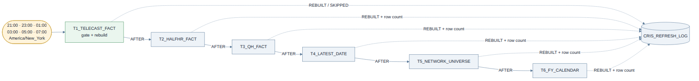

The root fires every two hours through the night (21:00 to 07:00 America/New_York) and rebuilds only when the UBD view carries a newer `BROADCAST_DATE` than `CRIS_TELECAST_FACT`; otherwise it logs `SKIPPED` and the children do not run. Whichever firing comes after A&E's load picks it up, before the team sits down at 9:00.

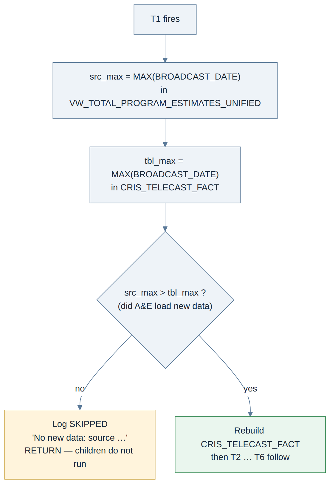

Each task builds `<table>_NEW`, swaps it in with `ALTER TABLE … SWAP WITH` and drops the old copy, so the live table is never empty while it rebuilds.

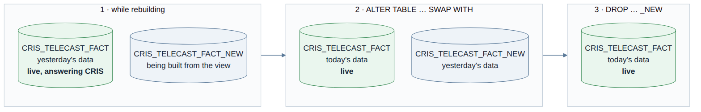

Every run writes to `CRIS_REFRESH_LOG`: one `SKIPPED` row when there is nothing new, one `REBUILT` row per table with its row count and latest `BROADCAST_DATE` otherwise. `CRIS_LATEST_DATE.REFRESHED_AT` moves with every rebuild. `v77/CRIS_Tasks_v77.ipynb` creates the tasks; `v76/CRIS_Tables_Scheduled_Refresh_v76.docx` explains how to watch, pause, reschedule or replace them.

---

## 13. What changed lately

| version | change |
|---|---|
| **v77** | 2.11 builds its quarter-hour norm per clock quarter hour (`p_norm_basis = SLOT`), without the runover rule on the norm side; reproduces Jill's "QH - New" sheet exactly (191 / 191 / 213 / 190 telecasts, 234 / 239 / 244 / 228, 92 programme rows with no difference). `SHAPE` keeps the v75 norm. Pending Tommy's confirmation. |
| **v76** | Scheduled refresh: `CRIS_Tasks` rebuilds the six tables every night (T1→T6, build-and-swap, freshness gate, `CRIS_REFRESH_LOG`). No query change. |
| **v75** | 2.10 measures each premiere telecast against the one telecast before it (`p_leadin_grain`), rollup by lead-in programme and airing; Modern Marvels: WWII returns 3 lead-ins as Jill counted them. 2.11's norm takes the premiere-norm exclusions; movement columns renamed `FINAL_VS_QH1_PCT` / `FINAL_VS_QH1_NORM_PCT`. |
| **v74** | 2.13 takes `p_norm_basis`, default `REPEATS`: the daypart average on repeat half hours only reproduces Jill's 128 for HIST M-SU 8P-12A (all programming gives 164). Output adds `DAYPART_NORM_BASIS`. |
| **v73** | Every query caps its window end at the latest full Sunday with data (`[CAP-SUN]`); Section 1 caps the target night at the latest night loaded; 3.2–3.4 read that Sunday from `CRIS_LATEST_DATE` instead of scanning the fact table. 2.11 adds `NORM_VS_PRIOR_QH_PCT` and `NORM_LAST_VS_FIRST_PCT`. |
| **v72** | 2.10 finds a lead-in within 5 minutes of the block start (`p_adjacent_min`); a night with none reads NO LEAD-IN. 2.5 / 2.6 report DEMO_USED = P2. 2.7 neutral network default. 2.11 window ends on the last full Sunday. |
| **v71** | Episode premiere = Nielsen `REPEAT_IND = 0` (A&E, 25 Sep); `IS_PREMIERE_CT` recomputed as the earliest first run of the season. Tables rebuilt. |
| **v70** | 2.2 premiere norm reproduces Jill's 393 telecasts / 32 series (8p–12a, first runs, no specials, movies or Curse of Oak Island). 2.9 measured over the season's dates with the 15-minute slot rule. 3.2 ties as `(tied)`. |
| **v66** | Output columns renamed to A&E's format (`_000`, `FROM_DATE` / `TO_DATE`, `DEMO_USED`, `IS_TARGET`). All 175 networks in the tables; `CRIS_TELECAST_ALL_NET` merged away. |
| **v61** | Last two simple averages (2.4, 2.8) made duration weighted. `p_min_tcasts` on 2.8 and 3.3. |

`docs/CRIS_Business_Decisions_Change_Log.docx` has the full history with who decided what and when.

---

*Figures are in `docs/figures/`; the Mermaid sources are in `docs/figures/src/` and the hand-drawn SVGs sit next to their PNGs, so any of them can be edited and re-rendered.*
